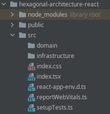
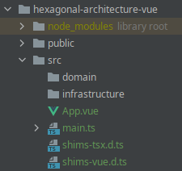

# How to implement Hexagonal architecture in frontend (Javascript/Typescript)

Table of contents:

1. [ Introduction ](#introduction)
2. [ Why is this architecture called hexagonal? ](#why)
3. [ Same concept different names ](#same)
4. [ How does it affect maintainability? ](#maintainability)
5. [ How does it affect the frontend? ](#frontend)
6. [ Historical context ](#historical)
7. [ Present ](#present)
8. [ Consequences ](#consequences)
9. [ What we do with frontend frameworks/libraries? ](#frameworks)
10. [ Example of Hexagonal Architecture ](#example)
    * [ Directories structure ](#examDir)
    * [ Domain ](#examDomain)
    * [ Data access ](#examData)
    * [ Views ](#examViews)
    * [ Third party libraries ](#examThird)
    * [ Tests ](#examTest)
11. [ Final words ](#final)

<a name="introduction"></a>
## Introduction :wave:
There are multiple definitions for the term architecture, depending on the context, and the development branch you come from. For these reasons is complicated to reach a consensus and a single definition that is valid for all cases. So, according to frontend software development, and from a professional point of view, the definition could be the next:

**Developers call architecture the set of development patterns that allow us to define guidelines to be followed in our software in terms of limits and restrictions. It is the guide that we must follow to order our code and make the different parts of the application communicate with each other.**

There is a wide range of options when it comes to choosing one architecture or another. Each
will have its own advantages and disadvantages. Even once we choose which one is the
best suited to our case, it does not necessarily have to be implemented in the same way in different projects.

However, although the amount of options is almost infinite, the most keep their quality attributes in common, such as: scalability, single responsibility, low coupling, high cohesion, etc.

So, in general way, it's crucial to understand the concepts, and the reason why you have chosen one solution or the other.

One of the most used patterns to design software architecture is Hexagonal Architecture, also known as Ports and Adapters.

The purpose of this pattern is to divide our application in different layers, allowing it to evolve in an isolated way and making each entity responsible for a single functionality.

<a name="why"></a>
## Why is this architecture called hexagonal? :thinking:

The idea of representing this architecture with a hexagon is due to the ease of associating the theoretical concept with the visual concept.
Inside this hexagon is where our base code is located. This part is called **domain**.

Each side of this hexagon represent an interaction with an external service, for example: http services, db, rendering...


The communication between **domain** and the rest of actors is performed in the **infrastructure** layer. In this layer we implement a specific code for each of these technologies.

One of the most recurrent question among professionals that see this architecture for the first time is: Why a hexagon? Well, the use of a hexagon is only a theoretical representation. The number of the services we could add is infinite, and we can integrate as many as we need.

<a name="same"></a>
## Same concept different names :unamused:

Hexagonal Architecture pattern is also called **Ports and Adapters**. This name come from a separation within a **infrastructure** layer, where we will have two sublayer:

- **Port**: It is the interface that our code should implement in order to abstract from technology. Here we define the method signatures that will exists.


- **Adapter**: It is the implementation of the interface itself. Here we will have our specific code to consume a concrete technology. It's important to know that this implementation should NOT be in our application, beyond the declaration, since its use will be realized through the **port**.

So, our domain will make calls to the sublayer that corresponds to the port, being decoupled from the technology, while the port, in turn, will consume the adapter.

The **Ports and Adapters** concept is very linked to object-oriented programming and to the use of interfaces, and maybe, the implementation of this pattern in functional programming could be different from the initial concept. In fact, it has arisen many patterns that iterate over this, such as **Onion architecture** or **Clean Architecture**. At the end the goal is the same: divide our application in layers, separating **domain** and **infrastructure**.

<a name="maintainability"></a>
## How does it affect maintainability? :monocle_face:

The fact of having our code separated in layers, where each of them has a single responsibility, it helps each layer to evolve in different ways, without impacting the others.

Also, with this segmentation we get a high cohesion, where each layer will have single and unique responsibility well-defined inside the context of our software.

<a name="frontend"></a>
## How does it affect the frontend? :open_mouth:

There are currently a number of shortcomings in the use of methodologies when creating applications. Today, we have an incredible amount of tools that allow us to develop applications very fast, and at the same time, we have put the analysis and implementation of known and proven architectures on the back burner.

Notwithstanding, even though this architectures may appear to be from the past, where the languages didn't evolve so fast, these architectures has been showed and adapted to give us the scalability we need to develop actual applications.

<a name="historical"></a>
## Historical context :sleeping:

Two decades ago desktop applications were the main tool to develop. In them, all our application was installed in the machine, through libraries, and there was a high coupling between view and behaviour.
Then, we wanted to scale our applications to get a software more maintainable, whit centralized databases. So many of them were migrated to a server. With this, our desktop apps were reduced to a "fool" applications, which didn't require access, persistence or many data.
Finally, if the app needed some data, it had the responsibility to perform this calls to the external servers through network services. It's here when we started to distinguish between "frontend" and "backend".

During the next years we got the web boom. Many desktop apps were adapted to the browsers, where the limitations were higher with only HTML. Later, JAVASCRIPT started to give more possibilities to the browser.

<a name="present"></a>
## Present :relieved:

The views had always been limited only to data representation and them had never needed higher functionalities, until now. With the common needs, frontend applications have more requirements than years ago. To name a few examples: state management, security, asynchrony, animations, integration with third party services...

For all of these reasons, we need to start to apply patterns on these apps.

<a name="consequences"></a>
## Consequences :partying_face:

As we have said, the purpose of the frontend is mostly to visualize data. Despite this perception, it is NOT the **domain** of our application, but belongs to the outer layers of the implement architecture.

The use cases of the app do belong to the **domain**, and they shouldn't know how the data must be visualized.

For example, suppose you are developing a shopping cart. One use case could be: "A shopping cart can not have more than 10 products".
Another use case: "A shopping cart can not have the same product twice or more". We can see the use cases as requirements in our application.

The data requests to backend belong to **infrastructure** layer, and it is something that our app doesn't need to know, even if we manage the backend (it is a different applications and has different architecture needs. At some point, the data scheme of backend could change, and we don't want to our app can be affected by that.

Another part that belong to **infrastructure** is the management of local data, like session data, cookies or local databases. Of course, we have to deal with this, but it is not part of our **domain**.

<a name="frameworks"></a>
## What we do with frontend frameworks/libraries? :sunglasses:

Nowadays there is a huge amount of libraries for rendering: Angular, React, Vue...; but we must understand what their purpose is, so they should not enter the **domain**, but they should be handled into the **infrastructure**.

All these tools tend to evolve quickly, and our code doesn't want to be affected by them. Now, how can we achieve that? Well, one of the most common strategies is wrap these libraries in created functionalities for this purpose. This strategy is known as "wrapping" and with that, we can isolate our code from the side effects that these libraries may have.

"Wrapping" is a good practice, but when we use it, we must do it through an **adapter** to reduce the coupling. Also, this technique has disadvantages too. For example, if we abuse of that, we may be over-engineering our product, increasing maintenance time. So, we have to identify in which cases it is worthwhile and in which cases it is not.

We can affirm that communication between **view (infrastructure)** and **domain** is unidirectional, it means, they are an entry point for the user, but they will never been consumed by the **domain**.

Once this is understood, we have to assume that tools highly coupled to these frontend libraries, like Redux or Vuex, must be managed in the **infrastructure** layer.

<a name="example"></a>
## Example of Hexagonal Architecture :rocket:

Now it's the show time, let's try to put all this theory into practice through an example. Let's write some code.

Imagine that we have to design a shopping cart, and we have to do it both in "reactjs" and in "vuejs".

First, we think in which entities come into play, known that we will retrieve the data through a third party service (we will see that later).

- **Product**
- **Cart**

We also know these entities must be available for the user, so that the user can interact with them. The user could do the next:

- See a list of products
- Add products to the shopping cart
- Remove products from the shopping cart

Now imagine that we have the following business rules:

- A shopping car can not have more than 5 products
- The same product can not be in the cart twice or more
- The maximum price of the cart must be 100 €

<a name="examDir"></a>
### Directories structure :card_index_dividers:

Here we can see an example about how organize the directories, for both the "React" and "Vue" applications.




In both cases we have created two directories: domain and infrastructure. All visual components are allocated inside infrastructure (remember that views and representations don't belong to our domain).

<a name="examDomain"></a>
### Domain :shield:

Now we are going to define the domain's models (Product and Cart). These models are identical in both applications.


```ts
// src/domain/models/Product.ts

export type Product = {
    id: string;
    title: string;
    price: number;
};
```

```ts
// src/domain/models/Carts.ts

import { Product } from './Product';

// This interface define what operations we can perform on a Cart
export interface ICart {
    createCart: () => Cart;
    addProductToCart: (cart: Cart, product: Product) => Cart;
    removeProductFromCart: (cart: Cart, product: Product) => Cart;
}

export type Cart = {
    id: string;
    products: Product[];
};

```

Now we define a functionality that allow us to add and remove a "Product", keeping in mind the requirements and business rules.

Depending on the design pattern we use this implementation might be slightly different. For this case we use an easy option, a service module that handle the data.

```ts
// src/domain/services/Cart.service.ts

import { Cart, ICart } from '../models/Cart';
import { Product } from '../models/Product';

const createCart = (): Cart => {
    return { id: Date.now().toString(), products: [] };
};

const hasProduct = (cart: Cart, product: Product): boolean => {
    return !!cart.products.find(item => item.id === product.id);
};

const isCartFull = (cart: Cart): boolean => {
    return cart.products.length >= 5;
};

const isCartLimitPriceExceeded = (cart: Cart, product: Product, limit: number): boolean => {
    let totalPriceCart = 0;
    cart.products.forEach(item => {
        totalPriceCart += item.price;
    });
    totalPriceCart += product.price;

    return totalPriceCart > limit;
};

const addProductToCart = (cart: Cart, product: Product): Cart => {
    if (!hasProduct(cart, product) && !isCartFull(cart) && !isCartLimitPriceExceeded(cart, product, 100))
        cart.products = [...cart.products, product];
    return { ...cart };
};

const removeProductFromCart = (cart: Cart, product: Product): Cart => {
    const productsWithRemovedItem: Product[] = [];
    cart.products.forEach(item => {
        if (item.id !== product.id) productsWithRemovedItem.push(item);
    });
    cart.products = [...productsWithRemovedItem];
    return { ...cart };
};

// This service must implement the operations defined for the Cart interface
export const cartService: ICart = {
    createCart,
    addProductToCart,
    removeProductFromCart
};

```

<a name="examData"></a>
### Data access :newspaper:

Also, we need to get a list of products. In most cases this data is obtained from http services, but we could also use graphql or any other library. Moreover, within http we could use fetch, axios, xhr...

In any case, this is part of the infrastructure layer, and this object will be consumed by a repository entity.

First, we define the structure of data returned by API. This kind of data is called "Data Transfer Object (DTO)":

```ts
// src/infrastructure/http/dto/ProductDTO.ts

export interface ProductDTO {
    id: string;
    title: string;
    description: string;
    price: number;
}

```

Furthermore, we have declared what methods we need implement for http. So, later we will be able to use our favourite client (fetch, axios...) implementing this interface:

```ts
// src/infrastructure/http/http.d.ts

export interface IHttp {
    get: <T>(path: string, params?: Record<string, any>, config?: any) => Promise<T | any>;
    post: <T>(path: string, params?: Record<string, any>, config?: any) => Promise<T | any>;
    put: <T>(path: string, params?: Record<string, any>, config?: any) => Promise<T | any>;
    delete: <T>(path: string, params?: any, config?: any) => Promise<T | any>;
}

```

Now it's time to create a wrapper for the library we have chosen, in our case, axios.

```ts
// src/infrastructure/http/httpAxios.ts

import { IHttp } from './http';
import axios from 'axios';

const headers = {
    'Content-Type': 'application/json'
};

export const httpAxios: IHttp = {
    get: async <T>(path: string, params?: Record<string, any>, config?: any) => {
        const response = await axios.get(path, { ...config, params: params, headers });
        return response.data as T;
    },
    post: async <T>(path: string, params?: Record<string, any>, config?: any) => {
        const response = await axios.post(path, { ...params }, { ...config, headers });
        return response.data as T;
    },
    put: async <T>(path: string, params?: Record<string, any>, config?: any) => {
        const response = await axios.put(path, { ...params }, { ...config, headers });
        return response.data as T;
    },
    delete: async <T>(path: string, params?: any, config?: any) => {
        const response = await axios.delete(path, { ...config, params: params, headers });
        return response.data as T;
    }
};

```

In this way, when you want to change the client and use, for example, fetch instead of axios, you can create a new http wrapper that implement the interface for http, but using fetch library. Easy!

To finalize this part, we need a last thing. We have to create a repository for products inside infrastructure. This repository handle the request and, the transformation of response data to our domain model.
For this example we have commented the line in which we call to API and, we have used a mock data.

```ts
// src/infrastructure/repositories/product.repository.ts

import { Product } from '../../domain/models/Product';
import { httpAxios } from '../http/httpAxios';
import {IHttp} from "../http/http";
import {productListMock} from "../http/mocks/products";

export interface IProductRepository {
    getProducts: () => Promise<Product[]>;
    getProductsById: (id: string) => Promise<Product[]>;
}

// Here we can change the client by one that implement the IHttp interface
const httpClient: IHttp = httpAxios;

export const productRepository: IProductRepository = {
    getProducts: async () => {
        //const products = await httpClient.get<ProductDTO[]>('http://localhost/products');
        const products = productListMock;
        return products.map((productDto): Product => ({ id: productDto.id, title: productDto.title, price: productDto.price }));
    },

    getProductsById: async id => {
        //const products = await httpClient.get<ProductDTO[]>('http://localhost/products', { id });
        const products = productListMock;
        return products.map((productDto): Product => ({ id: productDto.id, title: productDto.title, price: productDto.price }));
    }
};

```

<a name="examViews"></a>
### Views :iphone: :computer:

The view and layer to access to data are in infrastructure. However, they mustn't communicate directly. We are going to create a new service to consume our repository, so this data will available for the rest of our application.

```ts
// src/domain/services/Product.service.ts

import { IProductRepository, productRepository } from '../../infrastructure/repositories/product.repository';

// Here we can change the repository by one that implement the IProductRepository interface
const repository: IProductRepository = productRepository;

export const productService: IProductRepository = {
    getProducts: () => {
        return repository.getProducts();
    },
    getProductsById: id => {
        return repository.getProductsById(id);
    }
};

```

Well, now we have defined how to obtain the data, and the functionality we need to add/remove elements in our cart.

Regardless of whether you use react or vue, note that the code wrote so far is common to both apps, so the call to our methods from our component will be the same.

The first thing we are going to do know is define the initial state and, the functions to handle the cart state.

#### React
```tsx
// src/App.tsx

import React, { useState } from 'react';
import { Cart } from './domain/models/Cart';
import { Product } from './domain/models/Product';
import { cartService } from './domain/services/Cart.service';
import { ProductList } from './infrastructure/views/ProductList';

const App = () => {
    const [cart, setCart] = useState<Cart>(cartService.createCart());

    const handleAddToCart = (product: Product) => {
        setCart(cartService.addProductToCart(cart, product));
    };

    const handleRemoveToCart = (product: Product) => {
        setCart(cartService.removeProductFromCart(cart, product));
    };

    const renderCartProducts = (): JSX.Element[] => {
        const cartProducts: JSX.Element[] = [];
        let totalCart = 0;

        cart.products.forEach(product => {
            totalCart += product.price;
            cartProducts.push(
                <div key={product.id}>
                    <label>{product.title} </label>
                    <span>({product.price} €) </span>
                    <button onClick={() => handleRemoveToCart(product)}>remove</button>
                    <br />
                </div>
            );
        });

        cartProducts.push(
            <div key={'total'}>
                <br />
                <label>
                    <b>Total:</b>
        </label>
        <span>{totalCart} €</span>
        <br />
        </div>
    );
        return cartProducts;
    };

    return (
        <div>
            <h1>Shopping cart</h1>
            <h2>Products in the cart</h2>
            {renderCartProducts()}
            <ProductList onSelectProduct={handleAddToCart} />
        </div>
    );
};

export default App;

```

#### Vue
```vue
<!--
// src/App.vue
-->
<template>
    <div id="app">
        <h1>Shopping cart</h1>
        <h2>Products in the cart</h2>
        <div v-for="product in cart.products" :key="product.id">
            <label>{{ product.title }} </label>
            <span>({{ product.price }} €) </span>
            <button @click="handleRemoveProductFromCart(product)">remove</button>
            <br />
        </div>
        <div>
            <br />
            <label>
            <b>Total:</b>
            </label>
            <span>{{ getTotalCart() }} €</span>
            <br />
        </div>
        <ProductList @onSelectProduct="handleAddProductToCart" />
    </div>
</template>

<script lang="ts">
import { Product } from '@/domain/models/Product';
import ProductList from '@/infrastructure/views/ProductList.vue';
import { cartService } from '@/domain/services/Cart.service';
import { Cart } from '@/domain/models/Cart';

type DataProps = {
    cart: Cart;
};

export default {
    components: {
        ProductList
    },
    data(): DataProps {
        return {
            cart: cartService.createCart()
        };
    },
    mounted() {
        this.cart = cartService.createCart();
    },
    methods: {
        handleAddProductToCart(product: Product) {
            this.cart = cartService.addProductToCart(this.cart, product);
        },
        handleRemoveProductFromCart(product: Product) {
            this.cart = cartService.removeProductFromCart(this.cart, product);
        },
        getTotalCart() {
            let totalCart = 0;
            this.cart.products.forEach(product => {
                totalCart += product.price;
            });
            return totalCart;
        }
    }
};
</script>

```

We are going to show the list of products.

#### React

```tsx
// src/infrastructure/views/ProductList.tsx

import React, { useCallback } from 'react';
import { Product } from '../../domain/models/Product';
import { productService } from '../../domain/services/Product.service';

interface ProductListProps {
    onSelectProduct: (product: Product) => void;
}

export const ProductList: React.FC<ProductListProps> = ({ onSelectProduct }) => {
    const [products, setProducts] = React.useState<Product[]>([]);

    const getProducts = useCallback(async () => {
        try {
            const responseProducts = await productService.getProducts();
            setProducts(responseProducts);
        } catch (exception) {
            console.error(exception);
        }
    }, []);

    React.useEffect(() => {
        getProducts().then();
    }, []);

    const handleSelectProduct = (product: Product) => {
        onSelectProduct(product);
    };

    return (
        <div>
            <h2>List of products</h2>
            <ul>
                {products.map(product => (
                    <li key={product.id}>
                        <button
                            onClick={() => {
                                handleSelectProduct(product);
                            }}
                        >
                            {product.title}
                        </button>
                    </li>
                ))}
            </ul>
        </div>
    );
};
```

#### Vue
```vue
<!--
// src/infrastructure/components/ProductList.vue
-->
<template>
    <div>
        <h2>List of products</h2>
        <ul>
            <li v-for="product in products" :key="product.id">
                <button @click="handleSelectProduct(product)">{{ product.title }}</button>
            </li>
        </ul>
    </div>
</template>

<script lang="ts">
import { productService } from '@/domain/services/Product.service';
import { Product } from '@/domain/models/Product';

type DataProps = {
    products: Product[];
};

export default {
    name: 'ProductList',
    data(): DataProps {
        return {
            products: []
        };
    },
    mounted() {
        productService.getProducts().then(response => (this.products = response));
    },
    methods: {
        handleSelectProduct(product: Product) {
            this.$emit('onSelectProduct', product);
        }
    }
};
</script>
```

The state's management of cart's elements is interesting, but it is something related with the data visualization and this management belongs to the technology we are using (React or Vue).

Furthermore, if we pay atention to above code, we can see that all our code is decoupled. Our domain layer can be used both by react and by vue.

<a name="examThird"></a>
### Third party libraries :hammer_and_wrench:

Let's go to do a quick review about one library we have used, in this case axios. Our **domain** mustn't know anything about the existence of this library, I mean, we should be able to switch another library without affecting our **domain**.
I'm going to explain step by step:

- We have defined an interface `IProductRepository` that declare what methods have to be implemented by our repository.


- We have defined an interface `IHttp` that declare what methods have to be implemented by our web service.


- We have instantiated a `productRepository` that implement the interface `IProductRepository`.


- We have instantiated a `httpAxios` that implement the interface `IHttp`.


- Our `productRepository` instance uses an instance of `httpAxios`. If at any time you want to change the http library, for example, to fetch, you only have to write another client that implement the interface `Ihttp`


- Even if at any point you want to change the product repository, you could write another client that implement the interface `IProductRepository`.


Doing that, you have applied the dependency inversion principle, so now, you have a code low coupled, and with high cohesion.

<a name="examTest"></a>
### Tests :heavy_check_mark:

Of course, one thing you can't miss are the tests. Tests are important, even crucial. Yes I know, maybe you are thinking...Why would I want to write test if I can try the system manually?.
Well, it's very common that your application grow over time, so sure you will have to change some parts of your app. Then it becomes very tedious come back to test everything manually. Writing tests is the best way to be sure that our system works, and also, if some future changes have affected or broken our application.

Keep that in mind, many people have a percentage of test coverage above which they consider it sufficient. What do you think? Perhaps an 80% is right? Well, then you have a 20% of your system that can fail. There are no excuse to do things well, the only percentage of test coverage which ensures that our application works as you want is 100%.

Yes, I was one of them. I have written code without tests, but not because I didn't want to do tests, the problem was that having all the code scattered and mixed with the views, it was difficult if not impossible to write tests.

So, let's go write some test. You will see how easy is writing test after having implemented an appropriate architecture...having **domain** separated from **infrastructure**

To do test we use `jest`. From my point of view is the ultimate library to do testing in javascript.

First we are going to take the business rules (described in the introduction of this example, see above), and we are going to test each of them.

```ts
// src/__tests__/cart.test.ts

import { productService } from '../domain/services/Product.service';
import { cartService } from '../domain/services/Cart.service';

test('Car can not contain more than 5 products', async () => {
    const cart = cartService.createCart();
    const products = await productService.getProducts();

    cartService.addProductToCart(cart, products[0]);
    cartService.addProductToCart(cart, products[1]);
    cartService.addProductToCart(cart, products[2]);
    cartService.addProductToCart(cart, products[3]);
    cartService.addProductToCart(cart, products[4]);
    expect(cart.products.length).toEqual(5);

    cartService.addProductToCart(cart, products[5]);
    expect(cart.products.length).toEqual(5);
});

test('Add same product to cart', async () => {
    const cart = cartService.createCart();
    const products = await productService.getProducts();

    cartService.addProductToCart(cart, products[0]);
    expect(cart.products.length).toEqual(1);

    cartService.addProductToCart(cart, products[0]);
    expect(cart.products.length).toEqual(1);

    cartService.addProductToCart(cart, products[1]);
    expect(cart.products.length).toEqual(2);
});

test('Total cart price can not exceed 100 €', async () => {
    const cart = cartService.createCart();
    const products = await productService.getProducts();

    cartService.addProductToCart(cart, products[6]);
    expect(cart.products.length).toEqual(1);

    cartService.addProductToCart(cart, products[5]);
    expect(cart.products.length).toEqual(1);
});
```

We could do more tests, but that is not the main purpose of this tutorial.

<a name="finalWords"></a>
## Final words :hugs:

As we have seen, implementing a good architecture will allow us to improve the code maintenance. Also, we will be decoupled from the framework/library we are using, adding more value to the **domain**.

Don't forget that this pattern can be combined with other concepts, like DDD, Functional Programing...
Notwithstanding, the purpose of this example is  to give a basic idea of how we could implement hexagonal architecture in a frontend project.

I hope all this will help you in your day-to-day work and that, applying this or other patterns, you can improve the quality of your work.

If you have any doubt you can contact me through my email or leaving a comment here (for example in the [discussions](https://github.com/juanm4/hexagonal-architecture-frontend/discussions) section).

If you liked it share it...and remember:

WE RULE THE WORLD!
